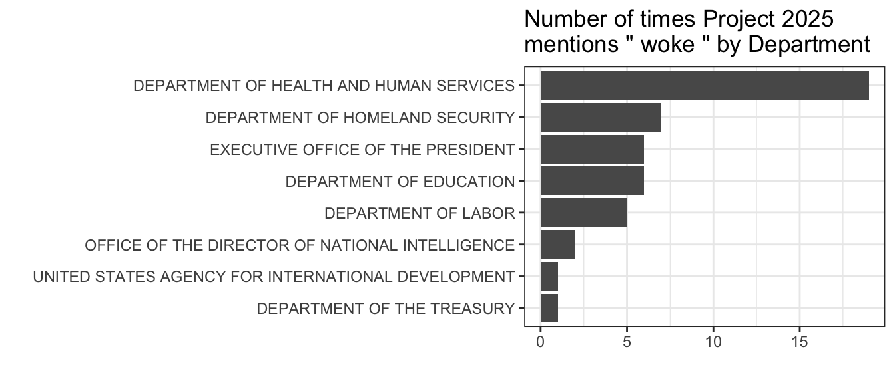

 more plots
[here](https://judgelord.github.io/2025/term_counts)

Please cite:

> Judge-Lord, Devin and Karla Magana. 2024. A Dataset for Text Analysis
> of Project 2025. https://github.com/judgelord/2025

The raw Project 2025 body text (parsed by paragraph and cleaned up a
bit):

- [data/body_text_clean.rda](data/body_text_clean.rda)

``` r
library(knitr)

load(here::here("data", "body_text_clean.rda"))

body_text_clean |> head() |> kable()
```

| text                                                                                                                                                                                                                                                                                                                                                                                                                                                                                                                                                                                                                                                                                                                                                                                                                                                                                                                      |
|:--------------------------------------------------------------------------------------------------------------------------------------------------------------------------------------------------------------------------------------------------------------------------------------------------------------------------------------------------------------------------------------------------------------------------------------------------------------------------------------------------------------------------------------------------------------------------------------------------------------------------------------------------------------------------------------------------------------------------------------------------------------------------------------------------------------------------------------------------------------------------------------------------------------------------|
| Section One                                                                                                                                                                                                                                                                                                                                                                                                                                                                                                                                                                                                                                                                                                                                                                                                                                                                                                               |
| TAKING THE REINS OF GOVERNMENT                                                                                                                                                                                                                                                                                                                                                                                                                                                                                                                                                                                                                                                                                                                                                                                                                                                                                            |
| America’s Bicentennial, which culminated on July 4, 1976, was a spirited and unifying celebration of our country, its Founding, and its ideals. As we approach our nation’s 250th anniversary, which will take place during the next presidency, America is now divided between two opposing forces: woke revolutionaries and those who believe in the ideals of the American revolution. The former believe that America is—and always has been—“systemically racist” and that it is not worth celebrating and must be fundamentally transformed, largely through a centralized administrative state. The latter believe in America’s history and heroes, its principles and promise, and in everyday Americans and the American way of life. They believe in the Constitution and republican government. Conservatives—the Americanists in this battle—must fight for the soul of America, which is very much at stake. |
| Just two years after the death of the last surviving Constitutional Convention delegate, James Madison, Abraham Lincoln warned that the greatest threat to America would come not from without, but from within. This is evident today: Whether it be mask and vaccine mandates, school and business closures, efforts to keep Americans from driving gas cars or using gas stoves, or efforts to defund the police, indoctrinate schoolchildren, alter beloved books, abridge free speech, undermine the colorblind ideal, or deny the biological reality that there are only two sexes, the Left’s steady stream of insanity appears to be never-ending. The next Administration must stand up for American ideals, American families, and American culture—all things in which, thankfully, most Americans still believe.                                                                                              |
| Highlighting this need, former director of the Office of Management and Budget Russ Vought writes in Chapter 2, “The modern conservative President’s task is to limit, control, and direct the executive branch on behalf of the American people.” At the core of this goal is the work of the White House and the central personnel agencies. Article II of the Constitution vests all federal executive power in a President, made accountable to the citizenry through regular elections. Our Founders wrote, “The executive Power shall be vested in a President of the United States of America.” Accordingly, Vought writes, “it is the President’s agenda that should matter to the departments and agencies,” not their own.                                                                                                                                                                                      |
| Yet the federal bureaucracy has a mind of its own. Federal employees are often ideologically aligned—not with the majority of the American people—but with one another, posing a profound problem for republican government, a government “of, by, and for” the people. As Donald Devine, Dennis Kirk, and Paul Dans write in Chapter 3, “An autonomous bureaucracy has neither independent constitutional status nor separate moral legitimacy.” Byzantine personnel rules provide the bureaucrats with their chief means of self-protection. What’s more, knowledge of such rules is used to thwart the President’s appointees and agenda. As Devine, Kirk, and Dans write, “Managing the immense bureaucracy of the federal government is impossible without an understanding of the key central personnel agencies and their governing laws and regulations.”                                                         |

A hand-coded crosswalk of the most relevant agency by section:

- [data/agencies_by_section.csv](data/agencies_by_section.csv)
- [data/agencies_by_section.rda](data/agencies_by_section.rda)

``` r
load(here::here("data", "agencies_by_section.rda"))

agencies_by_section |> head() |> kable()
```

| section                          | department                        | agency | subagency_name         | subagency_acronym | other_aliases |
|:---------------------------------|:----------------------------------|:-------|:-----------------------|:------------------|:--------------|
| TAKING THE REINS OF GOVERNMENT   | NA                                | NA     | NA                     | NA                | NA            |
| WHITE HOUSE OFFICE               | EXECUTIVE OFFICE OF THE PRESIDENT | EOP    | WHITE HOUSE OFFICE     | NA                | NA            |
| CHIEF OF STAFF                   | EXECUTIVE OFFICE OF THE PRESIDENT | EOP    | CHIEF OF STAFF         | NA                | NA            |
| DEPUTY CHIEFS OF STAFF           | EXECUTIVE OFFICE OF THE PRESIDENT | EOP    | DEPUTY CHIEFS OF STAFF | NA                | NA            |
| PRINCIPAL DEPUTY CHIEFS OF STAFF | EXECUTIVE OFFICE OF THE PRESIDENT | EOP    | DEPUTY CHIEFS OF STAFF | NA                | NA            |
| SENIOR ADVISERS                  | EXECUTIVE OFFICE OF THE PRESIDENT | EOP    | SENIOR ADVISERS        | NA                | NA            |

The Project 2025 body text, parsed by section, merged with the
crosswalk, and department, agency, and other acronyms extracted from the
text:

- [data/body_parsed.rda](data/body_parsed.rda)

``` r
library(dplyr)

load(here::here("data", "body_parsed.rda"))

body_parsed[127:128,] |> mutate(across(everything(), as.character)) |> kable()
```

| text                                                                                                                                                              | section                  | department                        | agency | subagency_name           | subagency_acronym | other_aliases | departments_mentioned | agencies_mentioned | acronyms_mentioned      |
|:------------------------------------------------------------------------------------------------------------------------------------------------------------------|:-------------------------|:----------------------------------|:-------|:-------------------------|:------------------|:--------------|:----------------------|:-------------------|:------------------------|
| The OPL should also have a sufficient number of deputies and special assistants to cover the vast number of disparate interest groups that are engaged daily. The | OFFICE OF PUBLIC LIAISON | EXECUTIVE OFFICE OF THE PRESIDENT | EOP    | OFFICE OF PUBLIC LIAISON | OPL               | NA            | NULL                  | OPL                | OPL                     |
| OPL has, by far, held more meetings in the Eisenhower Executive Office Building (EEOB) and within the West Wing itself than any other office within the WHO.      | OPL                      | EXECUTIVE OFFICE OF THE PRESIDENT | EOP    | OFFICE OF PUBLIC LIAISON | OPL               | NA            | NULL                  | OPL                | c(“OPL”, “EEOB”, “WHO”) |
